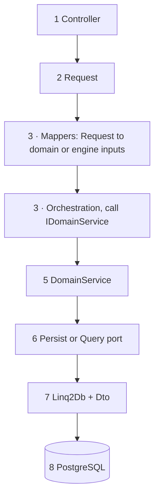
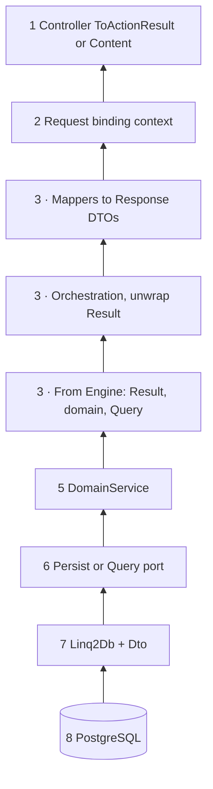
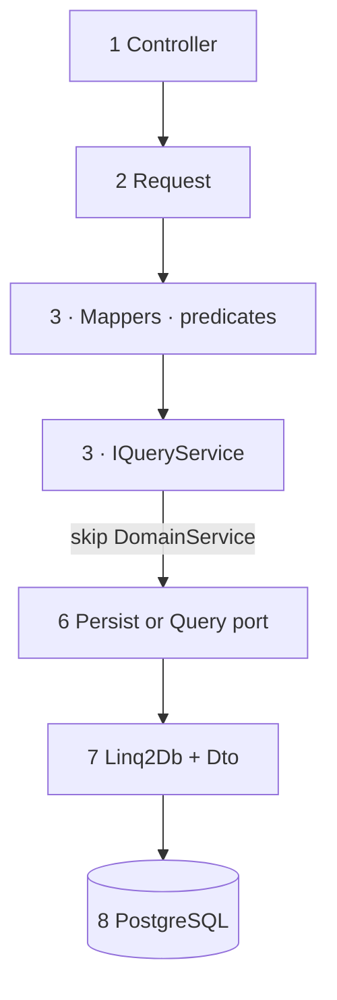

# Architecture layering (Certs UI)

How **MaksIT.CertsUI** (host) and **MaksIT.CertsUI.Engine** (library) split work so HTTP, business rules, and PostgreSQL stay in the right place. Complements `assets/docs/` (HA, auth, proxy).

**Branches, PRs, changelog:** [CONTRIBUTING.md](../../CONTRIBUTING.md).

---

## At a glance

| | **Host** `MaksIT.CertsUI` | **Engine** `MaksIT.CertsUI.Engine` |
|--|---------------------------|-------------------------------------|
| **Owns** | Controllers, app `Services/`, auth, DI, `ToActionResult()`, ProblemDetails | `Domain/`, `DomainServices/`, `Persistence/`, `QueryServices/`, integration `Services/` (e.g. ACME HTTP) |
| **Must not** | Linq2Db, raw SQL, `IPersistenceService` / `IQueryService` in controllers | `IActionResult`, HTTP types, host-only policy |
| **Returns** | HTTP responses | `Result` / `Result<T>` (`MaksIT.Results`) |

**Single spine (request direction):**

```text
Controller → App Service → IDomainService → IPersistenceService OR IQueryService → Linq2Db → PostgreSQL
```

**Shortcut (thin paged search in this repo):** **Controller → App Service → `I*QueryService` → …** with **no** **`IDomainService`** hop—see [Pattern B](#pattern-b-thin-search) (`IdentityService.SearchUsersAsync`, `ApiKeyService.Search…`).

**App Service** is drawn as a **box that contains** **`Mappers/`** on both sides of the Engine call: **Request / wire models → domain or engine inputs** (outbound), then **engine `Result` / `Query/` / domain → Response DTOs** (inbound). Mapping types live under **`MaksIT.CertsUI/Mappers/`**; orchestration and **`Result`** handling live in **`Services/`**.

Details: **[Request flow](#request-flow-to-database)** → **[Response flow](#response-flow-to-client)**. Reads: **[Query flow](#query-flow-reads)** (full stack vs thin search).

ACME HTTP and similar integration run **inside** the `IDomainService` step—not a parallel stack.

**Same layering as sibling MaksIT apps:** thin host `Services/` call **`I*DomainService`** (or **`I*QueryService`** for thin search). Hosted jobs resolve services via **`IServiceScope`** / **`IServiceScopeFactory`** and **Engine `IDomainService`** (and may call a **thin host façade** such as **`ICertsFlowService`**, which forwards to **`ICertsFlowDomainService`**); they **do not** resolve **`IPersistenceService`** / **`IQueryService`** directly from the worker class.

---

**Diagram convention:** **Every** spine figure is **linear**: a **single** **`-->`** chain (**no forks**). **Outbound** uses **`flowchart TB`** (**1** at top → **8 · PostgreSQL** at bottom). **Inbound** (response) uses **`flowchart BT`** (**8 → … → 1** toward HTTP). **Step 3 · App Service** appears as **one or more consecutive nodes** on that chain (labels name the beats).

## Request flow (to database)



| Step | Where | Role |
|:----:|-------|------|
| 1 | Host | Call **one** app service; `Result` → `ToActionResult()` (or `Content` for ACME token). |
| 2 | Host | Route + `MaksIT.Models` (or host models). |
| 3 | Host | **`App Service`**: **`Mappers/`** · Request → domain / engine inputs; orchestration; then **`IDomainService`** *or* (thin search) **`I*QueryService`**—see **Response** for **`Mappers/`** → Response DTOs. **JWT** (and similar) is enforced at the **controller**; extra filters or tenancy rules belong in the app service when you add them. |
| 5 | Engine | **`IDomainService`**: rules + orchestration; may call Engine **`Services/`** (HTTP). |
| 6 | Engine | **`IPersistenceService`** *or* **`IQueryService`** (one style per hop). |
| 7 | Engine | Linq2Db + **`Dto/`**; **persist mappers** for row / JSON columns. |
| 8 | DB | PostgreSQL. |

**Shortcuts (still one line, not a fork):**

- **Search / list:** sometimes **3 → 6** with no extra domain logic: app service → **`IQueryService`** → Linq2Db (middle steps **skipped**) — see **[Query flow — Pattern B](#pattern-b-thin-search)**.
- **Hosted:** **`IServiceScopeFactory`** → e.g. **`IRegistrationCacheDomainService`**, **`ICertsFlowDomainService`**, **`ICertsFlowService`** (`AutoRenewal`); never inject **`IPersistenceService`** / **`IQueryService`** on the **hosted** class itself.

**Variants at steps 6–7 only:**

| | Step 6 | Step 7 |
|--|--------|--------|
| **Write** | `IPersistenceService` | Domain→Dto if needed, then write |
| **Read by key** | `IPersistenceService` | Read Dto, Dto→Domain, return |
| **Read search** | `IQueryService` | Projection → domain or `Query/` type |

---

## Response flow (to client)

Data and **`Result<T>`** unwind **stage by stage** toward HTTP. Nothing “teleports” from Linq2Db to the controller: each layer maps what it owns.

**Spine (database → wire):** **data and `Result<T>`** walk **8→1** (PostgreSQL → … → Controller) in **one line**. Steps **8–5** are Engine-side (same as outbound). **3 · App Service** is **three beats on that line**: from Engine → unwrap **`Result`** → orchestrate → **`Mappers/`** · domain / **`Query/`** → **`MaksIT.Models`** / response DTOs. The Mermaid figure uses **`flowchart BT`** so arrows run **toward HTTP** (not toward the DB).

```text
PostgreSQL → … → IDomainService → App Service (internal: Mappers · → Response DTOs) → Controller → ToActionResult() / Content / ProblemDetails
```

| Step | Direction | Responsibility |
|:----:|-------------|----------------|
| 8→7 | Engine | **Persist path:** materialize **`Dto/`**; **`Persistence/Mappers`**: **Dto → domain**. **Query path:** materialize **`Dto/`** (or joined Dtos); **`QueryServices/.../Linq2Db`**: **Dto → `Query/`** (e.g. `MapToQueryResult`). |
| 7→6 | Engine | Port returns domain, **`Query/`** read model, or **`Result<T>`** payload. |
| 6→5 | Engine | **`IDomainService`** may enrich, validate, or aggregate before returning **`Result`**. |
| 5→3 | Host | **`App Service`**: orchestration · unwrap **`Result`**; **`MaksIT.CertsUI/Mappers`** · engine outputs / **`Query/`** / domain → response DTOs (**three consecutive nodes for step 3** in diagram). |
| 3→1 | Host | **`Controller`**: **`ToActionResult(result)`** or **`Content(...)`** (ACME). |



**Thin search shortcut:** if the request skipped **`IDomainService`**, the response still walks **7 → 6 → (skip 5) → 3 → 1**: **`Query/`** (already mapped from **`Dto/`** in step 7) → **`App Service`** (mapper inside step **3**) → **`Result`** → **`ToActionResult()`**.

---

## Query flow (reads)

Reads always hit **PostgreSQL through Linq2Db**; only **who calls the read port** changes.

**Mapping to query results (Engine read model):** inside **`QueryServices/.../Linq2Db`**, Linq2Db materializes **`Dto/`** table rows (or joins). Implementations then **map `Dto` → types under `Query/`** (e.g. `UserQueryResult`, `ApiKeyQueryResult`) before returning **`Result<List<…>>`** from **`Search`**. That **Dto → `Query/`** step is the **query-side read mapper**—not web API mappers and not **`Persistence/Mappers`** (those are for writes / JSON columns / domain load). See e.g. **`UserQueryServiceLinq2Db`** (`MapToQueryResult`).

**Predicates:** **`IUserQueryService`** and **`IApiKeyQueryService`** take **`Expression<Func<TDto, bool>>?`** plus **`skip` / `limit`** and a separate **`Count`** with the same predicate. The **host** builds translatable predicates (today: simple filters such as **`Contains`** on username/description). **`ExpressionCompose`** (`QueryServices/ExpressionCompose.cs`) is available when you need composed predicates through navigation—not required for the current search callers.

**Inside `IQueryService` (Linq2Db implementation):**

```text
PostgreSQL → Linq2Db (materialize Dto / joins) → optional Where(predicate) → map Dto → Query/ types → Result<List<…>> to caller; Count uses the same predicate
```

The caller is either **`IDomainService`** (Pattern A) or **app `Service`** (Pattern B).

### Pattern A: Domain-centered read (`IDomainService`)

Use when a use case must go through **one Engine orchestration place** (invariants, multiple ports, ACME side effects, load-by-key).

**In this repo, Identity and API keys use persistence for domain loads, not the query port:** e.g. **`ReadUserByIdAsync`** and **`ReadAPIKeyAsync`** go **App → `I*DomainService` → `I*PersistenceService` → Linq2Db** (**Dto → domain** via **`Persistence/Mappers`**), not **`I*QueryService`**.

**When listing is owned by the domain** (not implemented for Identity/API key search here), the shape is:

```text
Controller → App Service → IDomainService → IQueryService (PostgreSQL → … → Query/) → Result back up
```

**Response:** if the domain sits in the middle, unwind through **`IDomainService`**; if the request used **Pattern B**, **`IDomainService`** is skipped on the return path too (see [Response flow](#response-flow-to-client)).


### Pattern B: Thin search

Use when **only filtering + paging + projection** are needed and **no extra engine rules** apply. **This repo:** **`IdentityService.SearchUsersAsync`** and **`ApiKeyService.Search…`** (JWT on the **controller**; predicate built in the app service).

```text
Controller → App Service → IQueryService (impl: PostgreSQL → Linq2Db Dto → map → Query/) → Result back up
```

**Response:** **`IQueryService`** returns **`Result<List<QueryType>?>`** from **`Search`** (rows already mapped from **`Dto/`**); **`Count`** supplies **`TotalRecords`**. **App service** maps **`Query/`** → **`MaksIT.Models`** / paged API DTOs → controller → **`ToActionResult()`**.



**Pick A vs B:** **B** is what **Identity** and **API key** **search** use today. Prefer **A** (domain calls **`IQueryService`**) when list rules must live in Engine; **get-by-id** here stays **domain → `IPersistenceService`**, not **`IQueryService`**.

---

## Layers (detail)

### Host — `MaksIT.CertsUI`

| Layer | Responsibility |
|-------|----------------|
| **Controllers** | Thin: app service + `ToActionResult()`. No business rules, no Linq2Db. |
| **Models** | Often **`MaksIT.Models`** for shared API shapes with **MaksIT.WebUI**. |
| **App `Services/`** | **Only** controller entry for a use case: orchestration · **`IDomainService`** / **`IQueryService`**; **invokes** **`Mappers/`** before Engine (**Request** → domain / engine inputs) and after Engine (**`Result`** / **`Query/`** / domain → **Response** DTOs). |
| **Web `Mappers/`** (`Mappers/`) | Types used **from** app services: **Request** → domain / engine inputs; engine outputs → **Response** DTOs. Not **`Engine/Persistence/Mappers`** (table / JSON payloads). |

### Engine — `MaksIT.CertsUI.Engine`

| Layer | Responsibility |
|-------|----------------|
| **`DomainServices/`** | Use cases: **`IPersistenceService`**, Engine **`Services/`**; may also call **`IQueryService`** when a use case should own search (Identity/API key **search** in this repo is **Pattern B** from the host). No HTTP return types. |
| **`Persistence/`** | Writes (and load-by-key APIs): **`I*PersistenceService`** + Linq2Db, **`Dto/`**, **`Persistence/Mappers`**. |
| **`QueryServices/`** | Reads: **`I*QueryService`** + Linq2Db + **`Query/`**. |
| **`Services/`** (Engine) | Integration **used by** `DomainServices` (e.g. **`ILetsEncryptService`**). Not a second app-service layer. |
| **`Domain/`** | Entities / value objects: no Linq2Db, HTTP, or host types. |

**Engine slice (same idea as the spine):**

| | Purpose | Examples |
|--|---------|----------|
| **DomainServices** | Orchestrate persistence + integration; **`IQueryService`** only when domain owns search (not Identity/API key search here) | `CertsFlowDomainService`, `IdentityDomainService`, `RegistrationCacheDomainService` |
| **QueryServices** | Read port | `IUserQueryService` + `UserQueryServiceLinq2Db` |
| **Persistence** | Write port (+ loads exposed as persistence API) | `IRegistrationCachePersistenceService` |
| **Services** | Outbound HTTP / protocol | `ILetsEncryptService` |

**Guideline:** **`GetTable<>` / SQL** only in **`.../Linq2Db`** under Persistence and QueryServices.

---

## Solution map

| Project | Role |
|---------|------|
| **MaksIT.CertsUI** | ASP.NET: controllers, app services, mappers, DI, pipeline. |
| **MaksIT.CertsUI.Engine** | Domain, domain services, persistence, queries, migrations, ACME integration. |
| **MaksIT.Models** | Shared request/response for WebUI + API. |
| **MaksIT.WebUI** | React SPA. |
| **ReverseProxy** | Optional YARP. |
| **\*Tests** | Unit (Engine) and integration (host + DB). |

**Golden rule:** HTTP and status codes stay in the **host**; PostgreSQL and reusable orchestration stay in the **Engine** behind **`DomainServices`** (and persist/query ports).

---

## Folder layout

### `src/MaksIT.CertsUI/`

Host-only: composition, HTTP, auth, thin façades into Engine.

```
MaksIT.CertsUI/
├── Program.cs              # Pipeline, DI (AddCertsEngine, filters, hosted services)
├── Configuration.cs        # IOptions settings + secrets
├── Controllers/            # Thin; Result → ToActionResult (or Content for ACME)
├── Services/               # App services → IDomainService / IQueryService (search)
├── Mappers/                # Request/Response ↔ domain or Query/ (not Engine persist mappers)
├── Authorization/          # JWT, API key, filters, HttpContext helpers
├── Abstractions/           # e.g. ServiceBase, BaseAsyncAuthorizationFilter
├── HostedServices/         # Scope + engine domain (+ thin ICertsFlowService, etc.); not IPersistenceService on the worker
├── Infrastructure/         # e.g. IRuntimeInstanceIdProvider for HA
└── Properties/
```

*(Omitted from tree: `bin/`, `obj/`, `appsettings*.json`, Docker.)*

### `src/MaksIT.CertsUI.Engine/` (`Engine/` in prose)

```
Engine/
├── Domain/
├── DomainServices/
├── Dto/
├── Data/                   # CertsLinq2DbMapping
├── Persistence/
│   ├── Mappers/
│   └── Services/ … Linq2Db/
├── Query/
├── QueryServices/          # I*QueryService + ExpressionCompose; Linq2Db/… implementations
├── Services/               # LetsEncrypt etc. — called from DomainServices
├── Infrastructure/
├── FluentMigrations/
├── RuntimeCoordination/    # HA — see HA_ARCHITECTURE.md
├── Extensions/             # AddCertsEngine
└── Facades/ …
```

**Spelling:** most paths use **`Persistence`** (historic). A few types say **`Persistence`** — keep per-file consistency; do not mass-rename in small PRs.

**Mapper kinds:**

| Where | Maps |
|-------|------|
| **`MaksIT.CertsUI/Mappers`** | API request/response ↔ domain or **`Query/`** |
| **`Engine/Persistence/Mappers`** | Domain ↔ table row / JSON column (`Dto`) |
| **`Engine/QueryServices/.../Linq2Db`** (inline or private helpers) | **`Dto/`** rows / joins → **`Query/`** read models (e.g. `UserQueryResult`) |

---

## As-built routes (quick map)

Each row fits the **spine** above; only **persist vs query** and **skipped** steps differ.

### API + Engine

| Area | Controller | App service | Engine |
|------|------------|-------------|--------|
| ACME steps | `CertsFlowController` | `CertsFlowService` | `ICertsFlowDomainService` |
| ACME token | `WellKnownController` | `CertsFlowService` | `ICertsFlowDomainService` → `Content(text/plain)` |
| Identity CRUD / login | `IdentityController` | `IdentityService` | `IIdentityDomainService` |
| Identity search | `IdentityController` | `IdentityService` | `IUserQueryService` → mapper |
| API keys | `APIKeyController` | `ApiKeyService` | `IApiKeyDomainService` / `IApiKeyQueryService` |
| Registration cache | `CacheController` | `CacheService` | `IRegistrationCacheDomainService` |
| Accounts / certs | `AccountController` | `AccountService` | `ICertsFlowService` → `ICertsFlowDomainService` |

### Other

| Area | Entry | Notes |
|------|-------|------|
| Renewal | `AutoRenewal` | Scoped `IRegistrationCacheDomainService`, `ICertsFlowDomainService`, `ICertsFlowService` (calls `FullFlow` / cache load) |
| Agent | `AgentController` → `AgentService` | Outbound HTTP only; no Engine domain |
| Debug | `DebugController` | `IRuntimeInstanceId`; bypasses app services |

---

## Hard rules

1. **Controllers** → app **`Services/`** only (except trivial debug). No **`IPersistenceService`**, **`IQueryService`**, **`ILetsEncryptService`** on controllers.
2. **App services** → **`IDomainService`** for use cases; **`CacheService`** → **`IRegistrationCacheDomainService`**. Search may use **`I*QueryService`** (see Identity / API keys).
3. **`Domain/`** → no Persistence, Linq2Db, `HttpClient`, host types.
4. **`DomainServices/`** → ports + Engine **`Services/`**; no raw SQL / `GetTable<>` (only in Linq2Db types).
5. **Persistence Linq2Db** → **`ICertsDataConnectionFactory`**, **`Dto/`**, **`Data/CertsLinq2DbMapping`**.
6. **Engine JSON** (DB / zip) → **`MaksIT.Core`** `ToJson()` / `ToObject<T>()` (STJ); no new Newtonsoft in Engine.
7. **HTTP status** → host `ToActionResult()`; Engine stays on **`Result`**.

**Variance:** “DomainService on every read” is not required for **thin paged search**; adding a domain wrapper is optional if shared rules appear.

---

## Host details

- **Controllers:** inject **`Services/*`**; **`WellKnownController`** uses **`Content(..., "text/plain")`** for ACME.
- **App services:** inject Engine ports (**`IDomainService`**, **`IQueryService`** when searching), **`IOptions`**, other app services; **call `Mappers/`** for **Request → engine-shaped inputs** and **`Result` / `Query/` / domain → API response models**—keep mapping logic in **`MaksIT.CertsUI/Mappers/`**, orchestration in **`Services/`**.

---

## Dependency injection (Engine)

Central: **`Extensions/ServiceCollectionExtensions.cs`** (`AddCertsEngine`).

- **`ICertsDataConnectionFactory`** — Scoped  
- **Persistence / query Linq2Db** — Scoped  
- **`ILetsEncryptService`** — typed `HttpClient`  
- **`IRegistrationCacheDomainService`** — Scoped  
- **`IRuntimeLeaseService`** — Singleton where HA docs say so  

Avoid **Scoped** inside **Singleton** without `IServiceScopeFactory`; use scoped persistence for per-request work.

---

## Tests

- **MaksIT.CertsUI.Engine.Tests** — Engine unit tests (no full host).  
- **MaksIT.CertsUI.Tests** — Integration tests + PostgreSQL; mirror production DI where possible.

---

## Contributor checklist

1. New **HTTP use case** → controller → app **`Services/`** → **`IDomainService`** (or **`IQueryService`** for thin paging only).  
2. New **DB write** → **`Persistence/Services/I…`** + **`Linq2Db/`** + register; **`DomainServices`** call persistence—not host **`CacheService`** for engine rules.  
3. New **read/report** → **`QueryServices`** + **`Query/`**; either domain service or app service calls query—**match** Identity / API key search.  
4. New **table shape** → **`Dto/`** + **`CertsLinq2DbMapping`**.  
5. **JSON column mapping** → **`Persistence/Mappers`**, not controllers.  
6. **API contract** → **`MaksIT.Models`** + web mappers, not Engine `Dto` unless it is a real table shape.  
7. **Invariants** → **`Domain/`** or **`DomainServices/`**.  
8. **OpenAPI / status codes** → host only.

---

## Related docs

- [HA_ARCHITECTURE.md](./HA_ARCHITECTURE.md)  
- [LOGIN_AND_REFRESH_TOKEN_ARCHITECTURE.md](./LOGIN_AND_REFRESH_TOKEN_ARCHITECTURE.md)  
- [REVERSE_PROXY_ROUTING.md](./REVERSE_PROXY_ROUTING.md)  
- [PATCH_DELTA_REFERENCE.md](./PATCH_DELTA_REFERENCE.md)
